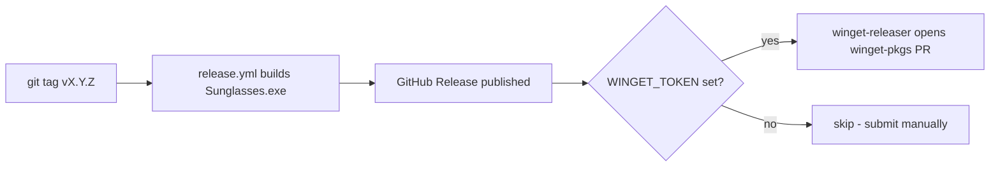

# winget packaging

Manifests for publishing Sunglasses to the
[winget community repo](https://github.com/microsoft/winget-pkgs).

Package identifier: **`mkronvold.Sunglasses`** (moniker: `sunglasses`).

## How releases reach winget



- **First version (1.0.0)** must be submitted **manually** (see below) —
  winget-releaser can only *update* a package that already exists upstream, it
  cannot create a brand-new one.
- **Every version after that** is submitted automatically by the `winget` job in
  [`.github/workflows/release.yml`](../.github/workflows/release.yml), as long as
  the `WINGET_TOKEN` secret is configured.

## One-time setup (human, requires a PAT)

These steps only need to be done once.

1. **Create a classic Personal Access Token (PAT)**
   - Go to <https://github.com/settings/tokens> → *Generate new token (classic)*.
   - Scope: **`public_repo`** (that's all winget-releaser / wingetcreate need).
   - Copy the token value.

2. **Fork the winget community repo** under the same account that owns the PAT:
   - Visit <https://github.com/microsoft/winget-pkgs> and click **Fork**.

3. **Add the token as a repo secret** so the workflow can use it:

   ```powershell
   gh secret set WINGET_TOKEN --repo mkronvold/sunglasses
   # paste the PAT when prompted
   ```

   (Or via the web UI: *Settings → Secrets and variables → Actions → New
   repository secret*, name `WINGET_TOKEN`.)

Once `WINGET_TOKEN` exists, future tagged releases auto-open a winget-pkgs PR.

## First submission of 1.0.0 (one-time, manual)

The 1.0.0 manifests in this repo are already valid and the SHA256 matches the
released `Sunglasses.exe` asset. Submit them upstream with
[wingetcreate](https://github.com/microsoft/winget-create) (needs the PAT above):

```powershell
winget install Microsoft.WingetCreate
wingetcreate submit `
  --token <YOUR_PAT> `
  winget/manifests/m/mkronvold/Sunglasses/1.0.0
```

This forks winget-pkgs (if needed) and opens the PR for you. Once the PR is
merged, `winget install mkronvold.Sunglasses` (or `winget install sunglasses`)
works for everyone.

## Cutting a new version (after 1.0.0 is live upstream)

1. **Tag the release** — the workflow builds and publishes `Sunglasses.exe` and
   prints the **InstallerSha256**:

   ```powershell
   git tag v1.0.1
   git push origin v1.0.1
   ```

2. The `winget` job in `release.yml` then opens the winget-pkgs PR
   automatically — no manual manifest editing required. winget-releaser computes
   the new SHA256 from the released asset and bumps `PackageVersion` /
   `InstallerUrl` for you.

3. (Optional) Keep the in-repo manifests under `winget/manifests/...` in sync for
   reference by copying the `1.0.0/` folder, bumping `PackageVersion`, and
   updating `InstallerUrl` + `InstallerSha256`.

## Validate manifests locally

```powershell
winget validate --manifest winget/manifests/m/mkronvold/Sunglasses/1.0.0
winget install --manifest winget/manifests/m/mkronvold/Sunglasses/1.0.0
```

